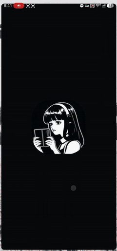

<p align="center"></p>

# Mono Hermes

**The official Hermes desktop UI on your Android device, as a remote client of your own `hermes serve`.
Best on tablets and foldables, works on phones.**

> **Unofficial community project.** Mono Hermes is **not affiliated with, authorized or endorsed by
> Nous Research**. "Hermes", "Hermes Agent" and the original Hermes artwork belong to Nous Research.
> See [NOTICE](NOTICE).

The app runs the unmodified desktop renderer from [hermes-agent](https://github.com/NousResearch/hermes-agent)
and reaches **your own** server over Tailscale. Desktop and Android attach to the same server, so sessions,
streaming turns and history are shared live.

```
 Android (Mono Hermes)                          your PC
 ┌───────────────────────────────┐   Tailscale   ┌──────────────────────────┐
 │ official desktop renderer     │  HTTPS (Serve)│ hermes serve --host      │
 │ + window.hermesDesktop bridge │ ────────────▶ │   127.0.0.1 --port 9119  │
 └───────────────────────────────┘  REST + WS    │ (also used by desktop)   │
                                                 └──────────────────────────┘
```

## Demo

| Tablet | Phone |
|:---:|:---:|
| <a href="docs/media/mono-hermes-demo.mp4"></a> | <a href="docs/media/mono-hermes-phone-demo.mp4"></a> |
| <sub>6x preview. <a href="docs/media/mono-hermes-demo.mp4">Full 1:36 demo</a>, Samsung Galaxy Tab S8 Ultra with the display at 2K resolution (that's why the full desktop layout shows).</sub> | <sub>4x preview. <a href="docs/media/mono-hermes-phone-demo.mp4">Full 1:05 demo</a> on a regular (non-foldable) phone.</sub> |

<sub>Real devices; private content blurred.</sub>

| Cover screen | Sidebar | Unfolded (settings) |
|---|---|---|
|  |  |  |

## Quick setup

Needs a PC running [Hermes](https://github.com/NousResearch/hermes-agent) with `hermes serve`,
[Tailscale](https://tailscale.com/download) on the PC and the Android device (same tailnet), and Android 7.0+.

- **Step by step** (Windows, macOS, Linux; Tailscale Serve or firewall, autostart, troubleshooting): [docs/SETUP.md](docs/SETUP.md)
- **Let an AI agent do the PC side** (paste one prompt into Hermes, Claude Code, Codex...): [docs/agent-setup-prompt.md](docs/agent-setup-prompt.md)

Then install the APK from [Releases](../../releases), open **Mono Hermes**, enter `https://<pc>.<tailnet>.ts.net`
(recommended, Tailscale Serve) or `http://<pc-tailscale-ip>:9119`, plus your Hermes username and password.
To share sessions with the desktop app, point it at the same server
(see [SETUP](docs/SETUP.md#8-share-sessions-with-the-desktop-app)).

## Security

- **Threat model:** your own server, reached only over your tailnet. Nothing is meant to be exposed to the
  public internet, and there is no Mono Hermes cloud: the app talks to the one server you enter. The
  recommended setup (Option A in [docs/SETUP.md](docs/SETUP.md)) binds Hermes to `127.0.0.1` and publishes it with
  Tailscale Serve, so nothing listens on your LAN and no firewall rule is involved. Option B binds `0.0.0.0` and
  relies on a Tailscale-only firewall rule: a wrong or missing rule exposes the port (behind the Hermes login) to
  your local network. Verify it with [`scripts/check-server-exposure.ps1`](scripts/check-server-exposure.ps1) or
  [`.sh`](scripts/check-server-exposure.sh) (read-only) and by trying `http://<PC LAN IP>:9119` from a device on
  the same Wi-Fi with Tailscale off, which must not load.
- **Transport:** with Tailscale Serve the URL is `https://<pc>.<tailnet>.ts.net` (a certificate the phone
  trusts); with Option B it is plain `http://` inside Tailscale, which encrypts traffic end to end
  (WireGuard). Android's network config cannot express IP ranges, so the app enforces the rule itself
  (`mobile/src/bridge/util.ts`): `http://` is accepted silently only for Tailscale (`100.64.0.0/10`,
  `*.ts.net`) and loopback. LAN addresses (`10/8`, `172.16/12`, `192.168/16`, `169.254/16`, `*.local` and
  single-label names) are cleartext on a shared network, so the app shows a warning and asks for explicit
  consent, remembered only for that exact server URL, before sending a password. Anything else must use
  `https://`. User-installed CAs are not trusted.
- **Authentication:** Hermes native password login with PKCE yields a short-lived bearer token plus a rotating
  refresh token; WebSockets use single-use, 30 s tickets. The password is sent once at login and never stored.
- **Stored on the device:** the server URL, the last username (to pre-fill the form) and the token set.
  Tokens are sealed with an AES-GCM key that is non-extractable in WebCrypto and kept in the WebView's
  IndexedDB; the ciphertext sits in Capacitor Preferences (app-private storage). This is **not** backed by
  the Android Keystore or secure hardware: it defeats casual inspection, not a rooted device or code
  running inside the app. Android backup and device transfer of app data are disabled. Moving the tokens to
  Keystore-backed storage is a planned hardening.
- **Permissions:** `INTERNET` (reach your server), `RECORD_AUDIO` and `MODIFY_AUDIO_SETTINGS` (voice input,
  asked at first use), `POST_NOTIFICATIONS` (local "turn finished" notifications). The keep-awake setting adds
  the normal `WAKE_LOCK`.
- **No telemetry:** no analytics, crash reporting or third-party servers in the app. Traffic goes to your
  server, plus pages you or the agent link to (image and link-title fetches). The bundled Hermes UI has its own
  opt-in usage-stats setting; its desktop metrics bridge is not implemented here, so it does nothing on Android.
- **Link titles:** the title fetch only contacts public web hosts, in the app's own native HTTP plugin
  (`BoundedHttp`) instead of the WebView: `http(s)` only, never loopback, Tailscale, LAN or IPv6-literal
  addresses. The plugin resolves the name itself, refuses it if **any** answer is non-public, and connects only to
  the addresses it validated, so a public name that resolves to a private address (DNS rebinding) is blocked. No
  system proxy is used, at most 3 redirects are followed (each one re-validated) and at most 64 KB are read.
- **Size limits** (enforced while streaming, never trusting `Content-Length` or a `HEAD`): link titles 64 KB;
  media 64 MB, held as one in-memory copy, with a Blob cache of 128 MB / 24 entries that is strict except for
  files playing at that moment; saved gateway files 1 GiB and saved images 32 MB, whether the image comes from
  http(s), a `data:` URL or a `blob:` URL. The native plugin owns these ceilings and refuses any request above
  them. An oversized download is aborted mid-transfer and never reaches memory or disk beyond the cap; free space
  is checked against the real size of the download, keeping 16 MB free on the phone.
- **Reporting a vulnerability:** use a private
  [GitHub security advisory](https://github.com/Monoperro0207/mono-hermes/security/advisories/new); see [SECURITY.md](SECURITY.md).

### Verify a release

1. **SHA-256** of the APK matches the value in the release notes (`sha256sum mono-hermes-<version>-release.apk`).
2. **Signer certificate** (needs Android build-tools): `apksigner verify --print-certs mono-hermes-<version>-release.apk`
   must show SHA-256 digest `86de4550a5fc023f2cb55ce0bae2f5d315525207b80335c560cf661ec8c845ce`.
3. **Build provenance** (signed statement that GitHub Actions built this exact file from this repository):
   `gh attestation verify mono-hermes-<version>-release.apk -R Monoperro0207/mono-hermes`

Provenance attestations exist for releases from 0.2.0 on. A release is only published after CI passes on the tag
(typecheck, unit tests, end-to-end tests against a real `hermes serve`, JVM tests of the native plugin, and an
Android emulator smoke test).

## What works and what does not

**Works:** chat and streaming, sessions and history, tool cards, approvals and clarify prompts, settings,
capabilities, artifacts, scheduled jobs, messaging pages, attachments (picker and camera), voice input (needs
the microphone permission and a server STT provider), local notifications while the app is alive, light and dark themes.

**Does not** (desktop-only features, hidden or inert): local backend and updater (the PC owns the backend),
host terminal, filesystem and git panels, the in-app browser or preview pane (links open in the system browser),
HUD, pet overlay, tray, extra windows, Hermes Cloud sign-in, SSH and multiple saved servers (one server only),
push notifications (a fully killed app is not woken by the server), and audio or video seeking
(media is downloaded whole, 64 MB hard cap enforced while downloading, so a larger file is aborted and refused).

## Compatibility and updates

The UI inside the app is **frozen per release**: the Hermes desktop UI at one pinned upstream commit. Your
Hermes **server** is yours to update (or fork) when you like. Each release is tested against its pinned Hermes
version and the previous one, and a small dismissible in-app notice appears when your server's version is newer
or older than that (an older server may still work fine). A new release ships when upstream UI changes are
worth integrating or a break is detected (a weekly workflow watches upstream). How it fits together:
[docs/how-it-works.md](docs/how-it-works.md).

| Mono Hermes | UI built from Hermes | Also tested against server |
|---|---|---|
| 0.2.x | 0.21.5, `158fd638da1629c8e62caf9ade1515d162def8ab` | 0.21.5, `10c6188de188871f64a88dd95bc6b262adb0c307` |
| 0.1.x | 0.21.5, `10c6188de188871f64a88dd95bc6b262adb0c307` | n/a |

## Build from source

Requires Node 22+, JDK 21, Android SDK (platform 36) and Git.

```
git clone --recurse-submodules https://github.com/Monoperro0207/mono-hermes
cd mono-hermes/mobile && npm ci && cd ..
powershell -File scripts/build-apk.ps1 -DebugOnly      # Windows; elsewhere see CONTRIBUTING.md
```

APKs land in `apk/`. A signed release APK needs your own keystore (see `mobile/android/keystore.properties.example`).
Tests, the UI audit and the release process are in [CONTRIBUTING.md](CONTRIBUTING.md).

## Contributing

Please read [CONTRIBUTING.md](CONTRIBUTING.md). Never edit `upstream/`; phone adaptations live in `mobile/`.

## License

MIT, see [LICENSE](LICENSE). The bundled Hermes UI is MIT (c) Nous Research; the icon is a derivative of
Nous Research artwork, see [NOTICE](NOTICE).
