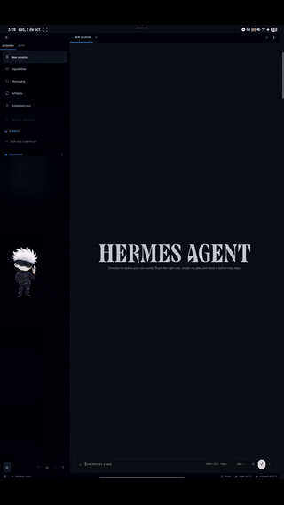
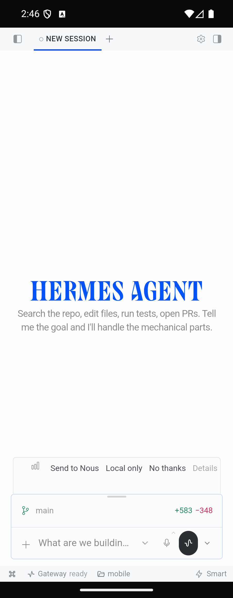
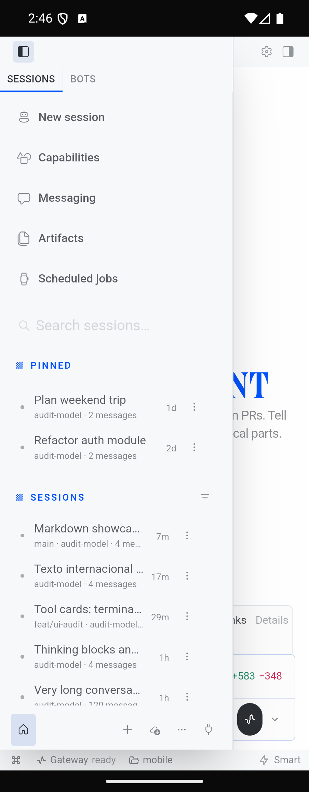
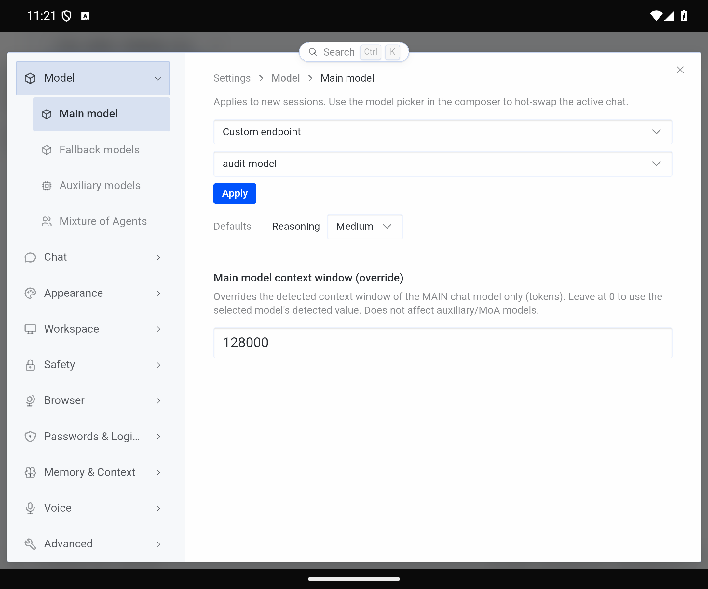

<p align="center"></p>

# Mono Hermes

> **Unofficial community project.** Mono Hermes is **not affiliated with, authorized or endorsed by
> Nous Research**. "Hermes", "Hermes Agent" and the original Hermes artwork belong to Nous Research.
> See [NOTICE](NOTICE).

An Android app that runs the **official Hermes desktop UI** (unmodified, from the
[hermes-agent](https://github.com/NousResearch/hermes-agent) desktop renderer) as a remote client of
**your own** `hermes serve`, reached over Tailscale. The desktop app and the phone attach to the same
server, so sessions, streaming turns and history are shared live.

```
 phone (Mono Hermes)                            your PC
 ┌───────────────────────────────┐   Tailscale   ┌──────────────────────────┐
 │ official desktop renderer     │  100.x.y.z    │ hermes serve --host      │
 │ + window.hermesDesktop bridge │ ────────────▶ │   0.0.0.0 --port 9119    │
 └───────────────────────────────┘  REST + WS    │ (also used by desktop)   │
                                                 └──────────────────────────┘
```

## Demo

<p align="center">
  <a href="docs/media/mono-hermes-demo.mp4"></a><br>
  <sub>6x preview. <a href="docs/media/mono-hermes-demo.mp4">Watch the full 1:36 demo</a> (screen-recorded on a Samsung Galaxy Tab S8 Ultra with the display at 2K resolution, which is why the full desktop layout shows; private content blurred).</sub>
</p>

## Quick setup

- **Step by step guide** (Windows, macOS, Linux; Tailscale, firewall, autostart, troubleshooting): [docs/SETUP.md](docs/SETUP.md)
- **Let an AI agent do the PC side** (paste one prompt into Hermes, Claude Code, Codex...): [docs/agent-setup-prompt.md](docs/agent-setup-prompt.md)

Then install the APK from [Releases](../../releases) and connect (see [Phone setup](#2-phone-setup)).

## Screenshots

| Cover screen | Sidebar | Unfolded (settings) |
|---|---|---|
|  |  |  |

(Emulator captures from the [UI audit](#ui-audit), with seeded demo data.)

## Requirements

- A PC (Windows, macOS or Linux) running [Hermes](https://github.com/NousResearch/hermes-agent) with `hermes serve`
- [Tailscale](https://tailscale.com/download) on the PC and the phone, same tailnet
- Android 7.0+ (a recent WebView, Chrome 111+)

## 1. PC setup (once)

> Condensed version. The full guide with autostart files and troubleshooting is [docs/SETUP.md](docs/SETUP.md).

**Install Hermes** with its official installer ([docs](https://github.com/NousResearch/hermes-agent#readme)):
`curl -fsSL https://hermes-agent.nousresearch.com/install.sh | bash` (macOS/Linux) or
`iex (irm https://hermes-agent.nousresearch.com/install.ps1)` (Windows PowerShell).

**Start the server:**

```
hermes serve --host 0.0.0.0 --port 9119
```

The first time, in an interactive terminal, Hermes asks how to authenticate: choose
**Username & password**. It stores a scrypt hash and a stable signing secret in `config.yaml`, so
later non-interactive starts - and phone sessions - survive restarts. A non-loopback bind always
engages the login gate, so the port is never open without credentials. `--host 0.0.0.0` matters:
the app's WebView origin is `http://localhost`, and the gateway only accepts that origin on its
WebSocket when bound to all interfaces.

**Find the PC's Tailscale address:** `tailscale ip -4` (a `100.x.y.z`) or its MagicDNS name
(`my-pc.<tailnet>.ts.net`).

**Firewall: allow port 9119 from Tailscale only.** This repo never changes your firewall; review before running.

<details open><summary>Windows (elevated PowerShell)</summary>

```powershell
New-NetFirewallRule -DisplayName "Hermes serve (Tailscale only)" -Direction Inbound `
  -Protocol TCP -LocalPort 9119 -RemoteAddress 100.64.0.0/10 -Action Allow
```
If Windows already created a broader "Allow" rule for `hermes.exe`/`python.exe`, delete it.
</details>

<details><summary>Linux (ufw)</summary>

```bash
sudo ufw allow from 100.64.0.0/10 to any port 9119 proto tcp   # and keep the default "deny incoming"
```
</details>

<details><summary>macOS (pf)</summary>

The built-in application firewall is not port based. Use a `pf` anchor (referenced from `/etc/pf.conf`):
```
pass  in quick proto tcp from 100.64.0.0/10 to any port 9119
block in quick proto tcp from any to any port 9119
```
Alternatively restrict access with Tailscale ACLs.
</details>

**Autostart (optional).**

<details><summary>Windows (scheduled task)</summary>

```powershell
$hermes   = Join-Path $env:LOCALAPPDATA 'hermes\bin\hermes.exe'
$action   = New-ScheduledTaskAction -Execute $hermes -Argument 'serve --host 0.0.0.0 --port 9119 --skip-build'
$trigger  = New-ScheduledTaskTrigger -AtLogOn
$settings = New-ScheduledTaskSettingsSet -ExecutionTimeLimit ([TimeSpan]::Zero) -MultipleInstances IgnoreNew `
  -RestartCount 5 -RestartInterval (New-TimeSpan -Minutes 1) -AllowStartIfOnBatteries -DontStopIfGoingOnBatteries
Register-ScheduledTask -TaskName 'Hermes serve' -Action $action -Trigger $trigger -Settings $settings
```
Remove with `Unregister-ScheduledTask -TaskName 'Hermes serve'`.
</details>

<details><summary>Linux (systemd user service)</summary>

`~/.config/systemd/user/hermes-serve.service`:
```ini
[Unit]
Description=Hermes serve
After=network-online.target

[Service]
ExecStart=%h/.local/bin/hermes serve --host 0.0.0.0 --port 9119 --skip-build
Restart=on-failure

[Install]
WantedBy=default.target
```
Then `systemctl --user enable --now hermes-serve` (and `loginctl enable-linger $USER` to start without a login).
</details>

<details><summary>macOS (launchd)</summary>

Create a LaunchAgent plist in `~/Library/LaunchAgents/` that runs
`~/.local/bin/hermes serve --host 0.0.0.0 --port 9119 --skip-build` with `RunAtLoad` and `KeepAlive`,
then `launchctl load` it.
</details>

## 2. Phone setup

1. Download the APK from [GitHub Releases](../../releases) (`mono-hermes-<version>-release.apk`; verify the
   SHA-256 in the release notes) and open it. Allow "install unknown apps" for your browser/file manager.
   Or from a computer: `adb install -r mono-hermes-<version>-release.apk`.
2. Make sure the Tailscale app is connected.
3. Open **Mono Hermes**, enter `http://<pc-tailscale-ip>:9119`, your username and password, then **Connect**.

Changing server or signing out: **Settings -> Gateway** in the app. If the session is lost (password
changed, 30 days idle) the connect screen reappears by itself.

## 3. Share sessions with the desktop app

In the Hermes desktop app: **Settings -> Gateway -> Remote connection**, URL `http://127.0.0.1:9119`
(or the Tailscale address), sign in with the same username and password. Desktop and phone now share one
backend: start a turn on one, watch it stream on the other.

## Compatibility and updates

The UI inside the app is **frozen per release**: it is the Hermes desktop UI at one pinned upstream
commit. Your Hermes **server** (agent, models, tools) updates freely on the PC with `hermes update`. A new
Mono Hermes release ships only when upstream desktop UI changes are worth integrating or a compatibility
break is detected; a weekly workflow watches upstream for both.

| Mono Hermes | Built for Hermes | Upstream commit | Tested backend |
|---|---|---|---|
| 0.1.0 | 0.21.5 | `10c6188de188871f64a88dd95bc6b262adb0c307` | 0.21.5 |

If your server is newer than the app was tested with by a minor version, or older than it, the app shows a
small dismissible notice suggesting you check for a Mono Hermes update. It is advisory only; patch
releases of the same minor version are expected to work.

## What works and what does not

Works: chat and streaming, sessions and history, tool cards, approvals/clarify prompts, settings,
capabilities, artifacts, scheduled jobs, messaging pages, attachments (Android picker/camera), voice
input (needs the microphone permission and a server STT provider), local notifications while the app is
alive, light/dark themes.

Does not (desktop-only features, hidden or inert):

- **Local backend**, installer, auto-update, uninstall: the PC owns the backend (`hermes update`).
- **Terminal pane, local filesystem/git panels, worktrees, project folder picker**: they act on the *host*
  machine. The agent still runs tools on the PC normally.
- **In-app browser / preview pane** (an Electron webview): links open in the system browser.
- **HUD, pet overlay, quick entry, extra windows, tray, global shortcuts, screenshot tools**.
- **Hermes Cloud sign-in, SSH connections, multiple saved servers**: one server only.
- **Push notifications**: a fully killed app is not woken by the server; keep it backgrounded, not swiped away.
- **Audio/video** from the PC is downloaded whole before playing (64 MB cap, no seeking); multipart plugin uploads are unsupported.

## Build from source

Requirements: Node 22+, JDK 21, Android SDK (platform 36), Git.

```
git clone --recurse-submodules <this repo>
cd mobile && npm ci && cd ..
powershell -File scripts/build-apk.ps1 -DebugOnly      # Windows
```

On Linux/macOS run the same steps by hand (see `.github/workflows/ci.yml`): `node ../scripts/link-upstream-modules.mjs`,
`npx tsc --noEmit -p .`, `npx vite build`, `npx cap sync android`, then `./gradlew assembleDebug` in `mobile/android`.
APKs land in `apk/` (script) or `mobile/android/app/build/outputs/apk/`. A signed release APK needs your own
keystore: copy `mobile/android/keystore.properties.example` to `keystore.properties` (git-ignored). The
app version comes from `mobile/package.json`.

Tests (in `mobile/`): `npx tsc --noEmit -p .`, `npx vitest run`, and `npm run test:e2e` (starts an
**isolated** throwaway `hermes serve` with random credentials in a git-ignored folder; it never touches your own Hermes).

## UI audit

`npm run ui:audit` (in `mobile/`) drives the real renderer in a phone-sized browser (Fold cover/inner
screens, phone, tablet) and reports clipped text, overflow, off-screen or overlapping controls, small touch
targets, hover-only controls and more, into `mobile/ui-audit/REPORT.md`. Details: [docs/how-it-works.md](docs/how-it-works.md#ui-audit).

## Updating upstream

```
powershell -File scripts/update-upstream.ps1      # Windows;  scripts/update-upstream.sh elsewhere
```
Moves `upstream/` to the commit of your installed Hermes (full-SHA `git fetch --depth 1`), records the
commit and Hermes version in `mobile/upstream-pin.json`, re-syncs dependencies and re-typechecks the
bridge. It stages the change; you review, run `npm run ui:audit` and the e2e suite, and commit.

## Contributing

Please read [CONTRIBUTING.md](CONTRIBUTING.md). Never edit `upstream/`; phone adaptations live in `mobile/`.
How the bridge works: [docs/how-it-works.md](docs/how-it-works.md).

## License

MIT, see [LICENSE](LICENSE). The bundled Hermes UI is MIT (c) Nous Research; the icon is a derivative of
Nous Research artwork - see [NOTICE](NOTICE).
